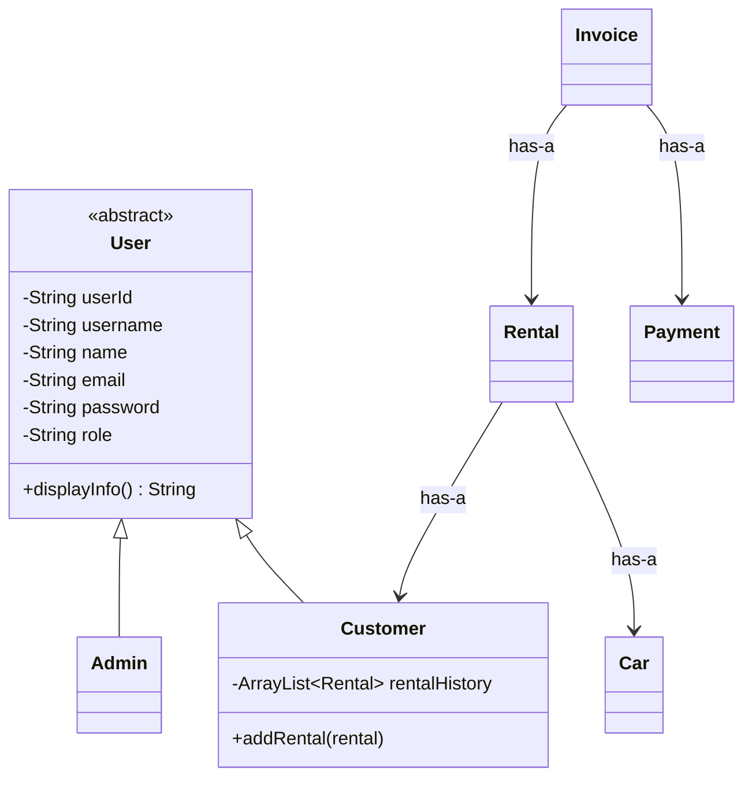
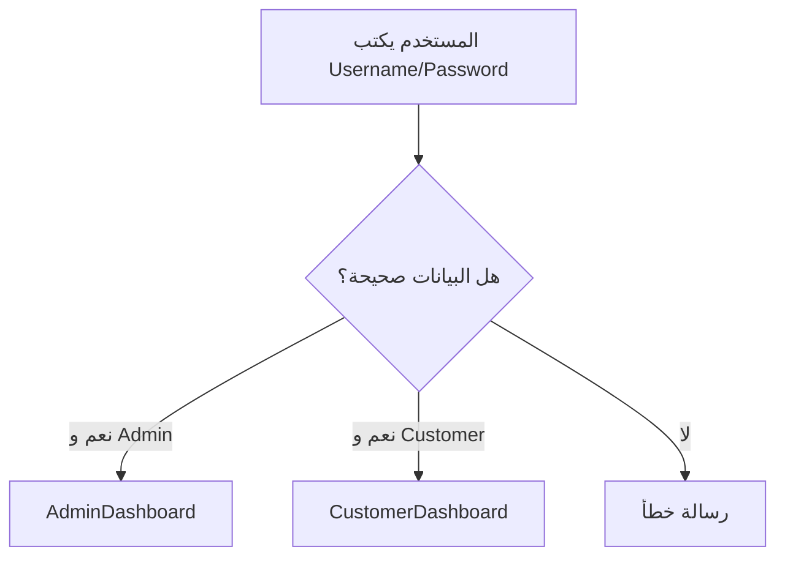
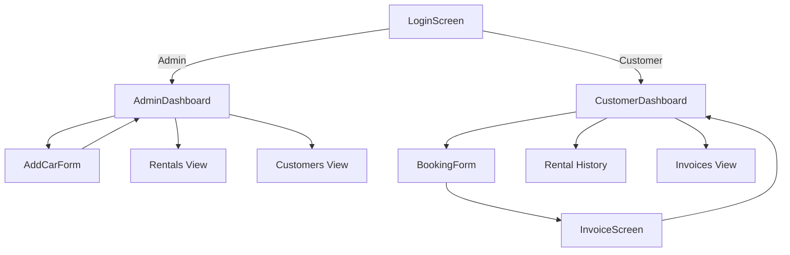
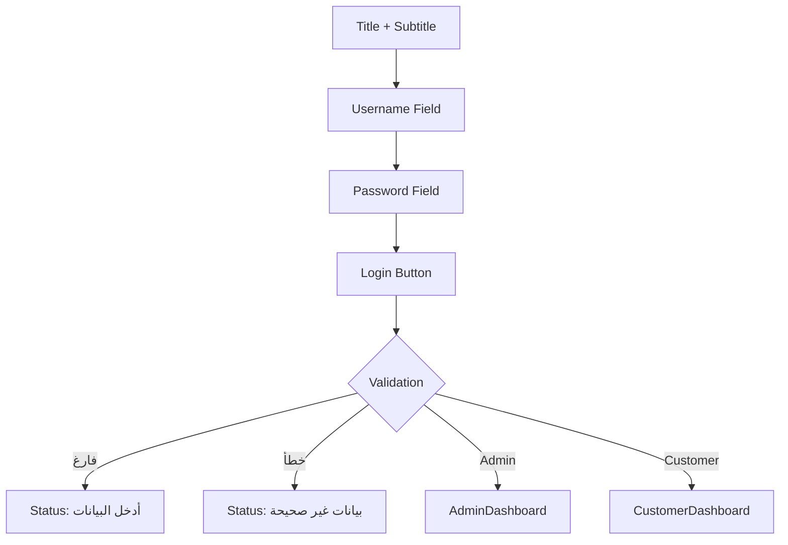
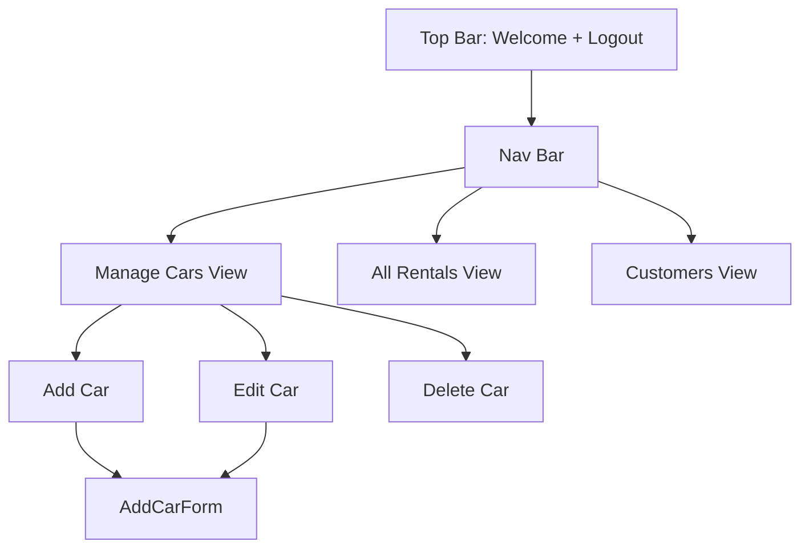
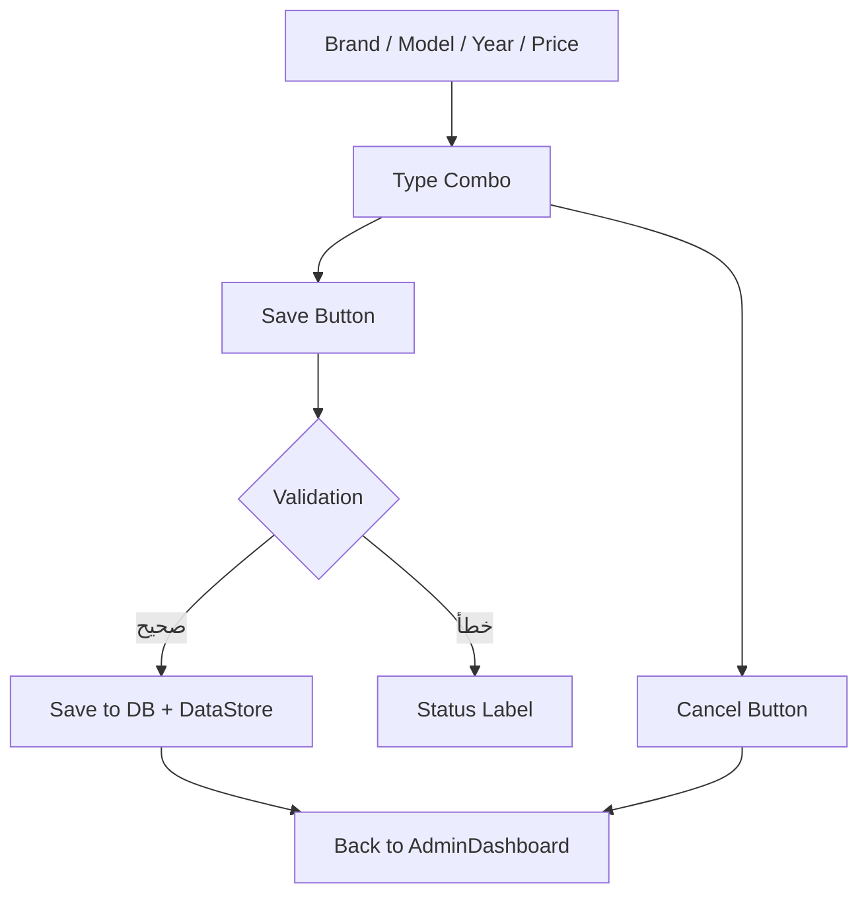
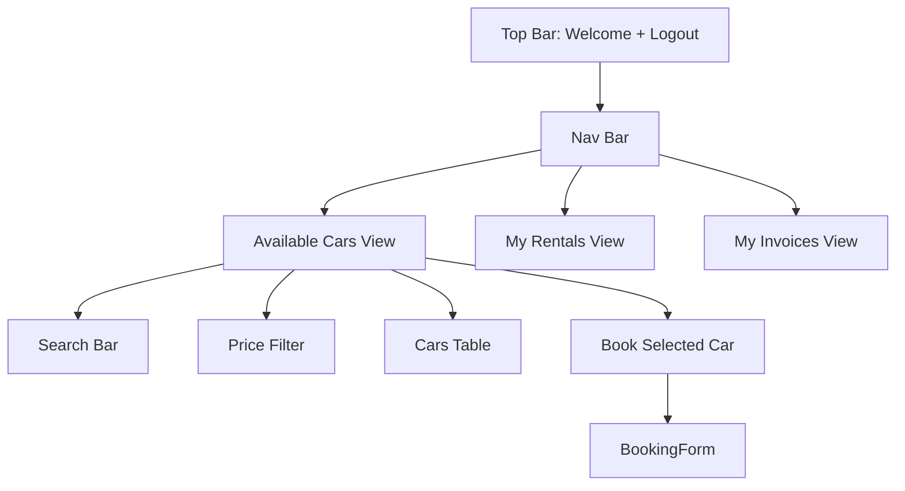
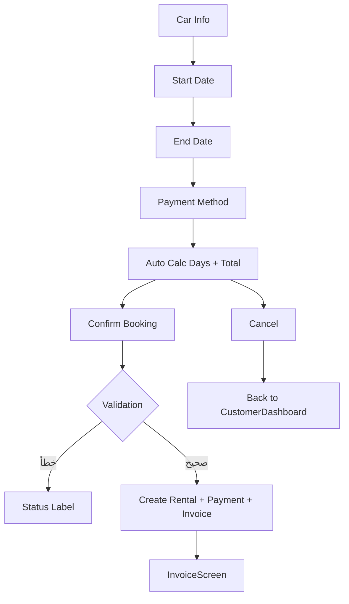
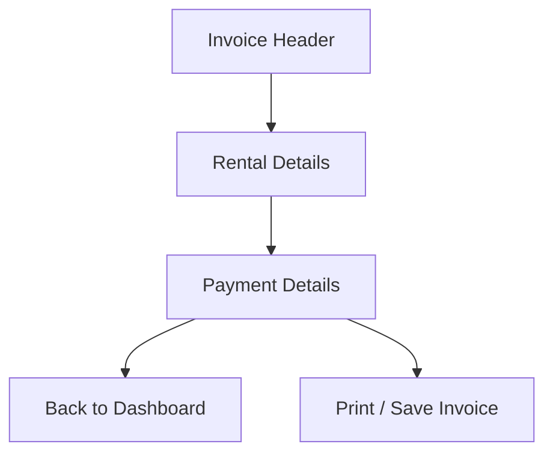

# Visualization (شرح بصري مبسّط)

الهدف من الملف ده إن أي حد جديد يقدر يشوف صورة سريعة لطريقة الشغل داخل السيستم.
الرسومات مكتوبة بـ **Mermaid** علشان تظهر تلقائيًا في GitHub.

> **ملاحظة مهمة عن الذكاء الاصطناعي (AI):**
> المشروع الحالي لا يحتوي على نموذج ذكاء اصطناعي حقيقي. البحث والفلترة هنا منطق برمجي تقليدي (IF/LOOP).

---

## 1) Class Diagram (العلاقات بين الكلاسات)



---

## 2) Booking Flow (رحلة الحجز خطوة بخطوة)

```mermaid
flowchart TD
    A[Customer يفتح شاشة السيارات] --> B[اختيار سيارة متاحة]
    B --> C[فتح نموذج الحجز BookingForm]
    C --> D[اختيار تاريخ البداية والنهاية]
    D --> E[حساب عدد الأيام والسعر]
    E --> F[تأكيد الحجز]
    F --> G[إنشاء Rental]
    G --> H[إنشاء Payment (محاكاة)]
    H --> I[إنشاء Invoice]
    I --> J[حفظ البيانات في DataStore + قاعدة البيانات]
    J --> K[عرض شاشة الفاتورة InvoiceScreen]
```

---

## 3) Login Flow (تسجيل الدخول)



---

## 4) GUI Navigation Map (خريطة تنقل الشاشات)



---

## 5) LoginScreen (تفاصيل الشاشة)



---

## 6) AdminDashboard (تفاصيل الشاشة)



---

## 7) AddCarForm (تفاصيل الشاشة)



---

## 8) CustomerDashboard (تفاصيل الشاشة)



---

## 9) BookingForm (تفاصيل الشاشة)



---

## 10) InvoiceScreen (تفاصيل الشاشة)


